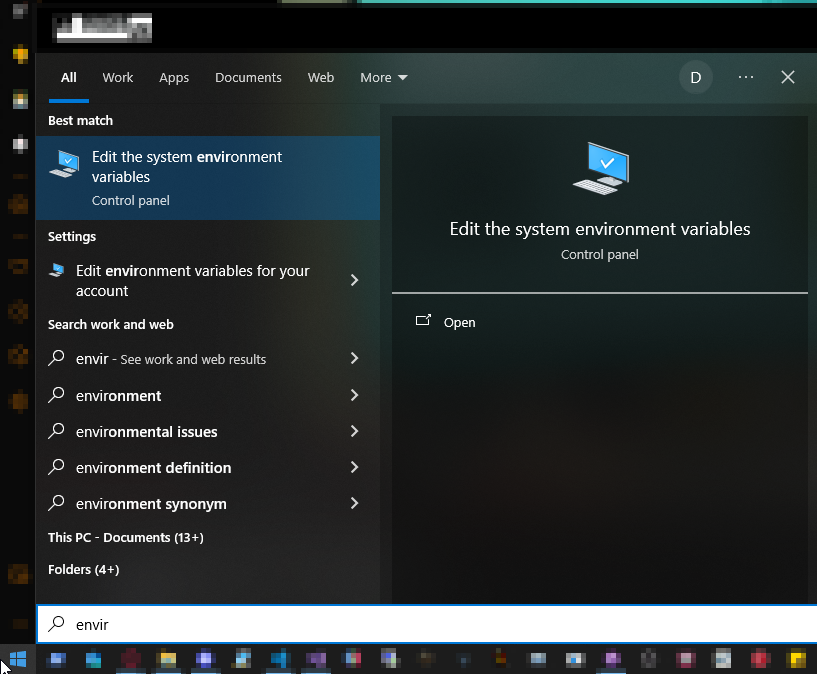
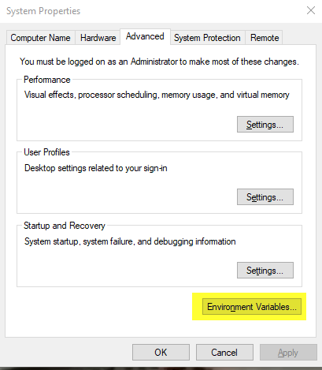
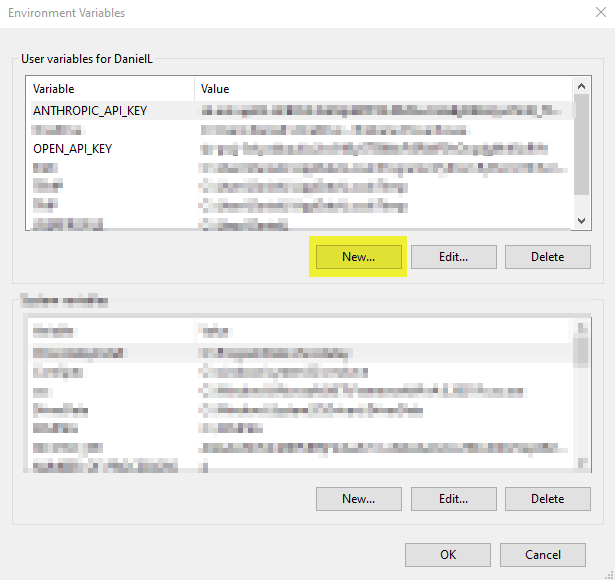
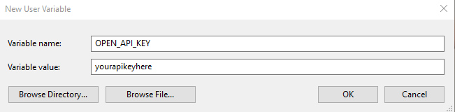

# Dantalion

## GUI Use
I've not packed it as a release as I want to reduce the amount of files required, for now just clone and run LocalGPTGUI.exe from the "Main" folder

## Current state

As of right now the only included AI is the Anthropic api, using Claude 3.5.
The next planned AI I will be integrating is DeepSeek Coder V2.
I will eventually be including compatability with Gemini and ChatGPT.

The chat model works, it can send chat's to and from the GUI with no issue, but requires more testing, especially with the C# file handling.
Memory management is being worked on, references to it still exist in LGPT_FileAccess.cs but these were giving compatability errors, I'll be moving what I can to the main Python module in response to this.

All icons used in the GUI are subject to, and will emphatically face a change.

I'm working on a speech module, if I can get this functional I will swap out the vaguely threatening orb in the GUI with a realtime waveform.

No plans to make this Linux or OSX compatible as yet.

## Your API keys need to be set to environment variables

anthropic_ai.py is set as "ANTHROPIC_API_KEY"

You could modify this to use a .env file or load the key directly but I'd not recommend that.

to set your environment variable hit the start menu > type in "environment" > select "edit the system environment variables" > new window > "Environment Variables..." > New Window > hit new... under user variables, name it to correspond to the program and then set the value as your api key.

## Console connection added

The file `console_connect.py` will allow you to run this in a Powershell or CMD console, good for debugging.

To run via console:
`$: cd "Path\to\your\python\files"`
`$: Python .\anthropic.py`
Launch a second console
`$: cd "Path\to\your\python\files"`
`$: Python .\console_connect.py`

## Errors in main modules

anthropic_ai.py may display that importing the LocalGPT.dll failed, this is just a limitation of Visual Studio Code and they will both be able to import the dll without issue.

## Building the CS

**Requires** .net 6.0 and 8.0. These aren't negotiable, both are absolutely required.

I built these with the latest VS, Visual Studio 2022 with a lot of additional functions enabled but for now 6.0 and 8.0 runtime will allow you to modify the C# components.

The GUI is a WPF, LocalGPT is a console app.

LocalGPT.dll/exe needs to stay targeted toward the .net 6.0 framework, it will build if you run as 8.0 but will not import correctly into the Python script.

LocalGPTGui.exe is built with the .net 8.0 framework, it might function on .net 6.0 but just leave it at 8.0 for the sake of compatibility.

**NuGet packages used** MdXaml==1.27.0 and WPFMediaKit==2.2.1
